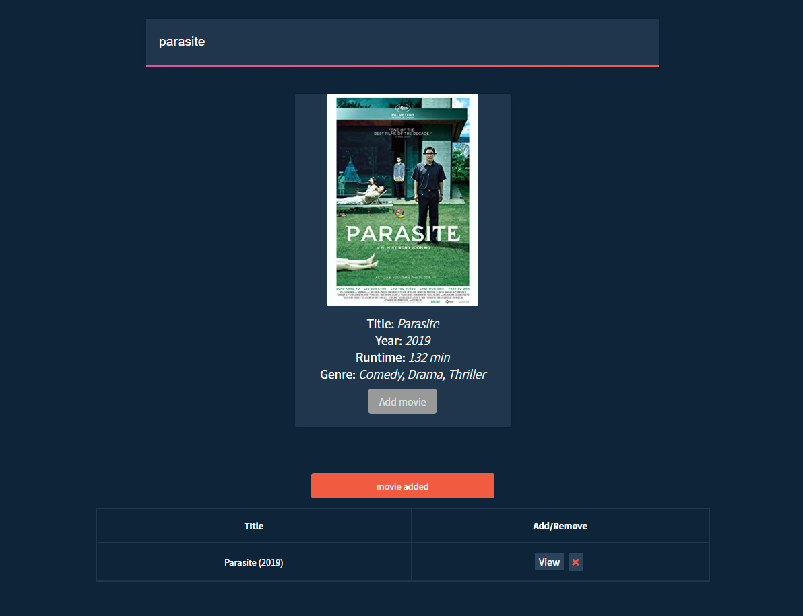

# Ongoing Project - Refactoring with React

# Shopify Frontend Intern Challenge.

Live demo - https://www.luigidimude.com/shopify/index.html

 a webpage that can search OMDB for movies, and allow the user to save their favourite films they feel should be up for nomination. When they've selected 5 nominees they should be notified they're finished.
 
- As a user I should be able to search for films to nominate
Users must be able to see at least a title, year of release and a nominate button
As a user I expect that the list of results will change as I update my search term
As a user I should be able to nominate a film which will appear in a nomination list
As a user I should be able to un-nominate a film or remove a nomination.
As a user I should be able to see a list of the films I have nominated
As a user I should not be able to nominate the same film twice
As a user I should be able to nominate a film if it is a remake or reboot and has a different year of release but the same title as a prior release
Users should have the ability to share a link with others that shows what films they have nominated
Users nominations should be remembered when they return to the page
As a user I should see a banner when I nominate 5 films
As a user I should not see a banner if I have nominated 5 films and remove one
 
**Technical requirements**
- Search results should come from OMDB's API (free API key: http://www.omdbapi.com/apikey.aspx).
- Each search result should list at least its title, year of release and a button to nominate that film.
- Updates to the search terms should update the result list
- Movies in search results can be added and removed from the nomination list.
- If a search result has already been nominated, disable its nominate button.
- Display a banner when the user has 5 nominations and disable search button.

**Built with**
- HTML 
- CSS 
- Javascript
- Jquery

**Sample UI of APP**

